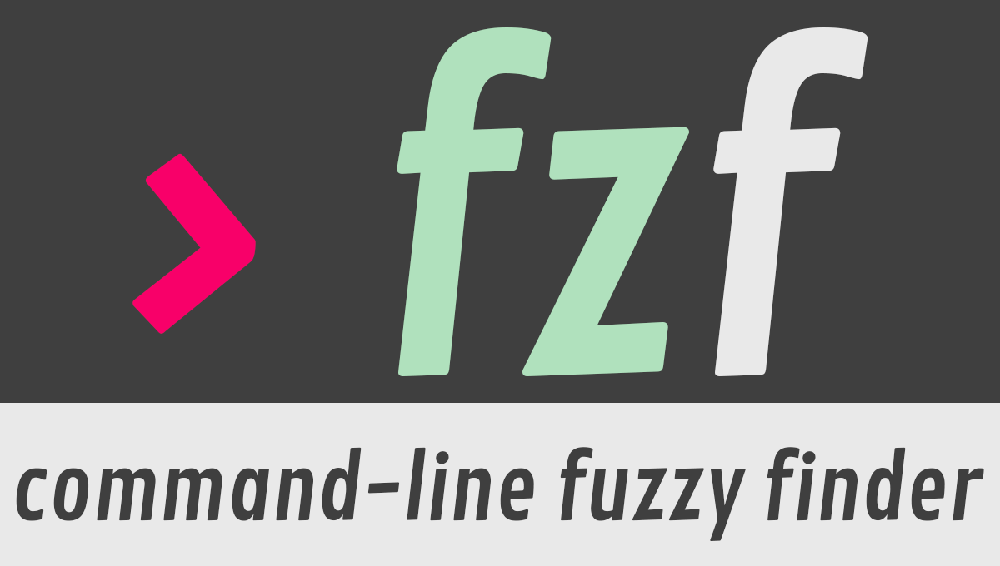

# 🏠 dotfiles
モダンな開発環境のための設定ファイル一式

## ✨ 特徴
- Zsh + Powerlevel10k + Zinit による**モダンなシェル体験**
- WezTerm による**GPUアクセラレーション対応ターミナル**
- Neovim + LSP + プラグイン群による**強力なテキストエディタ**
- カスタムキーバインド付きの**拡張されたtmux**設定
- Nix + Home Managerによる**再現可能なCLIツールチェーン**（fzf, eza, bat, ripgrep, gh, tmux, neovim, git、各種言語ランタイムなど）

## 📁 構成
このdotfilesリポジトリには以下の設定が含まれています:
- **🐚 Zsh** (`.zshrc`, `.p10k.zsh`, `.zsh/`)
- **🖥️ Tmux** (`.tmux.conf`)
- **💻 WezTerm** (`.wezterm.lua`)
- **✏️ Neovim** (`.config/nvim/`)
- **📦 Nix / Home Manager** (`.config/home-manager/flake.nix`, `home.nix`) — 宣言的なCLIパッケージ管理。macOSとUbuntuで同じように動く

chezmoiとHome Managerの役割分担は固定している: **chezmoiがdotfiles/設定ファイルを所有**し、**Home ManagerがCLIパッケージを所有**する。`home.nix`は設定ファイルを生成する`programs.*`モジュールを意図的に使わないため、この2つが同じファイルを取り合うことはない。

## 🚀 クイックセットアップ

### 前提条件
以下がインストール済みであることを確認してください:
- Git
- Zsh（デフォルトシェルに設定済み）
- アイコン表示のための [Nerd Font](https://www.nerdfonts.com/)

### インストール
このリポジトリは [chezmoi](https://www.chezmoi.io/) の標準レイアウトで管理されている: ソースは `~/.local/share/chezmoi` にあり（カスタム設定は不要）、`~/dotfiles` シンボリックリンクが利便性のために張られている。

1. **chezmoiをインストール:**
   ```bash
   brew install chezmoi                        # macOS
   sh -c "$(curl -fsLS get.chezmoi.io)"         # Linux（他プラットフォームも同様）
   ```
   （それ以外の依存関係は [依存関係](#-依存関係) セクションや [詳細インストールガイド](docs/INSTALL.md) を参照）

2. **クローンと適用を1コマンドで:**
   ```bash
   chezmoi init --apply Lain-5OR4
   ```
   `github.com/Lain-5OR4/dotfiles` を `~/.local/share/chezmoi` にクローンして展開する。`chezmoi diff` で事前に確認したい場合は `--apply` を外して実行する。

3. **（任意）`~/dotfiles` の利便性シンボリックリンクを追加:**
   ```bash
   ln -s ~/.local/share/chezmoi ~/dotfiles
   ```

4. **CLIパッケージ用にHome Managerをブートストラップ（macOSでもUbuntuでも同じコマンド）:**
   ```bash
   curl -fsSL https://install.determinate.systems/nix | sh -s -- install                        # Nix（未インストールの場合）
   nix run github:nix-community/home-manager -- switch --flake ~/.config/home-manager --impure  # 初回のswitchのみ
   ```
   `chezmoi apply` の時点で `~/.config/home-manager/{flake.nix,home.nix}` は既に展開済み。このステップはそこで宣言されたパッケージ（fzf, eza, ripgrep, bat, gh, tmux, neovim, git、各種言語ランタイム等）を実際にインストールする。`flake.nix` は実行時にOS/CPUを検出する（`builtins.currentSystem`）ため `--impure` が必要で、そのおかげでマシンごとにコマンドを変える必要がない。初回switch後は `home-manager` が `PATH` に乗り、以降の変更は下記の `hms` エイリアスを使う。

   **Ubuntu/Linuxの場合はこの前に一手間必要:** `flake.nix`は`neovim-nightly-overlay`のビルド回避用にnix-communityのバイナリキャッシュを`nixConfig`で指定しているが、実際に使われるには自分がNixの`trusted-users`に入っている必要がある（Determinate Nixは`/etc/nix/nix.conf`を自前管理するため、`/etc/nix/nix.custom.conf`に書く）:
   ```bash
   echo "trusted-users = root $(whoami)" | sudo tee -a /etc/nix/nix.custom.conf
   sudo systemctl restart nix-daemon
   ```
   やらなくても大抵はソースビルドにフォールバックして成功するが、遅く、まれに失敗する。詳細は [docs/INSTALL.md](docs/INSTALL.md#3a-ubuntulinux-trust-yourself-for-the-neovim-nightly-binary-cache) を参照。

5. **ターミナルを再起動**すれば完了!

日常的な使い方: `chezmoi edit <path>`（または `chezmoi source-path` 配下を直接編集）でファイルを編集し、`chezmoi diff` でプレビューし、`chezmoi apply` で反映する。詳細は [chezmoiのドキュメント](https://www.chezmoi.io/user-guide/daily-operations/) を参照。

**インストールするCLIパッケージを変更するには:** chezmoi経由で `home.nix` を編集し（`chezmoi edit ~/.config/home-manager/home.nix`）、`chezmoi apply` で変更を展開し、`hms`（`home-manager switch --flake ~/.config/home-manager --impure` のエイリアス）で実際にパッケージをインストール/削除する。必ずchezmoiのソース経由で編集すること。展開先のファイルを直接編集すると両者がドリフトしてしまう — これはまさに今回のNix移行で解決しようとした問題そのもの（[MAINTENANCE_AUDIT.md](docs/MAINTENANCE_AUDIT.md) 参照）。

## 📦 依存関係

### macOS + Ubuntu: Nix / Home Managerで管理
`home.nix` は fzf, eza, ripgrep, bat, gh, tmux, git, neovim（nightly）, jq, fastfetch, deno, python, node, go, zig などを宣言している。個別にインストールする代わりに、上記の [Home Managerブートストラップ手順](#-クイックセットアップ) を実行する — `nix run github:nix-community/home-manager -- switch --flake ~/.config/home-manager --impure`（初回以降は `hms`）でまとめてインストール/更新できる。`flake.nix` は `builtins.currentSystem` で実行時にOS/CPU（`x86_64-linux`, `aarch64-linux`, `aarch64-darwin`, `x86_64-darwin` など）を検出するため、macOSノートPCでもUbuntu機でも同じコマンドで動く。`aarch64-darwin`・`x86_64-linux`・`aarch64-linux` での評価による検証に加え、macOS（`aarch64-darwin`）・Ubuntu（`x86_64-linux`）実機での`switch`実行も確認済み。Ubuntuでは`neovim-nightly-overlay`のソースビルドでGCCのLTOがまれにクラッシュすることがあったため、上記 [クイックセットアップ](#-クイックセットアップ) のUbuntu向け手順（バイナリキャッシュを使うためのtrusted-users設定）を推奨する。`aarch64-linux`実機は未検証（評価のみ）。

### 手動フォールバック（Arch、WSL、またはNixを使わないmacOS/Ubuntu）


- **[fzf](https://github.com/junegunn/fzf)** - あいまい検索
  ```bash
  sudo apt install fzf
  ```

- **[eza](https://github.com/eza-community/eza)** - モダンな `ls` の代替
  ```bash
  # Ubuntu/Debian
  sudo apt install eza
  
  # macOS
  brew install eza
  
  # Arch Linux
  sudo pacman -S eza
  ```

- **[ripgrep](https://github.com/BurntSushi/ripgrep)** - 高速なgrep代替
  ```bash
  sudo apt install ripgrep
  ```

- **[bat](https://github.com/sharkdp/bat)** - シンタックスハイライト付きcat
  
  ```bash
  # Ubuntu/Debian
  sudo apt install bat
  
  # macOS
  brew install bat
  
  # Arch Linux
  sudo pacman -S bat
  ```

### ターミナルエミュレータ


**[WezTerm](https://wezfurlong.org/wezterm/index.html)** - GPUアクセラレーション対応ターミナルエミュレータ
- GitHub: https://github.com/wez/wezterm

### Zshのセットアップ


**プラグインマネージャ**: [zinit](https://github.com/zdharma-continuum/zinit)

**プラグイン**:
- [zsh-autosuggestions](https://github.com/zsh-users/zsh-autosuggestions)
- [Fast Syntax Highlighting](https://github.com/zdharma-continuum/fast-syntax-highlighting)
- [zsh-completions](https://github.com/zsh-users/zsh-completions)
- [zsh-z](https://github.com/agkozak/zsh-z)
- [powerlevel10k](https://github.com/romkatv/powerlevel10k)

### Neovimのセットアップ
**プラグインマネージャ**: 💤[Lazy.nvim](https://github.com/folke/lazy.nvim)

## 🔧 デプロイの仕組み
`chezmoi apply` はこのリポジトリの `dot_*` エントリを読み込み、`$HOME` 配下に展開する（例: `dot_zshrc` → `~/.zshrc`、`dot_config/nvim/` → `~/.config/nvim/`、`dot_config/home-manager/` → `~/.config/home-manager/`）。`.chezmoiignore` に列挙されたファイル（README、LICENSE、`doc/`、`docs/`）は展開対象から除外される。

なお `chezmoi apply` が展開するのは `flake.nix`/`home.nix` という*ファイルそのもの*だけで、パッケージのインストールは行わない。そこで宣言された内容の実際のインストール/更新には別途 `home-manager switch --impure`（または `hms`）の実行が必要 — 詳しくは [クイックセットアップ](#-クイックセットアップ) を参照。

## 🎨 カスタマイズ

このdotfilesを自分好みにカスタマイズしたい場合は、[詳細なカスタマイズガイド](docs/CUSTOMIZATION.md) を参照:

- カスタムZshエイリアス/関数の追加
- 追加のNeovimプラグインのインストール
- テーマ・カラーのカスタマイズ
- 個人用キーバインドの設定
- OS別の設定

### クイックカスタマイズTips
- 一般的なシェル設定は `~/.zshrc` を編集
- カスタムエイリアスは `~/.zsh/config/alias.zsh` を編集
- プロンプトのカスタマイズは `p10k configure` を実行
- Neovimプラグインは `~/.config/nvim/lua/plugins/` に追加
- CLIパッケージの追加/削除は `home.nix` の `home.packages` リストを編集後、`chezmoi apply && hms`（macOS・Ubuntu共通）

## 🔧 キーバインド

### Neovim
| キー | 動作 |
|-----|--------|
| `jj` | インサートモードを抜ける |
| `Space + h` | 行頭へ移動 |
| `Space + l` | 行末へ移動 |
| `Space + tt` | ファイルツリーの表示切替 |
| `Space + ff` | ファイル検索（Telescope） |
| `Space + fg` | ライブgrep（Telescope） |
| `Ctrl + g` | GitHub Copilotの提案を受け入れる |

### Tmux
| キー | 動作 |
|-----|--------|
| `Ctrl + g` | プレフィックスキー |
| `\` | 水平分割 |
| `-` | 垂直分割 |

## 📝 補足
- デフォルトシェルをzshにしておくこと: `chsh -s $(which zsh)`
- macOS/Ubuntuでは `chezmoi apply` だけではCLIパッケージはインストールされない — Home Managerのswitch（または `hms`）も実行すること
- Nixを使わないプラットフォーム（Arch、WSLなど）では、`chezmoi apply` の前に依存関係を手動でインストールすること
- `chezmoi apply` の前に `chezmoi diff` で変更内容を事前に確認すること
- インストール後は変更を反映させるためターミナルを再起動すること
